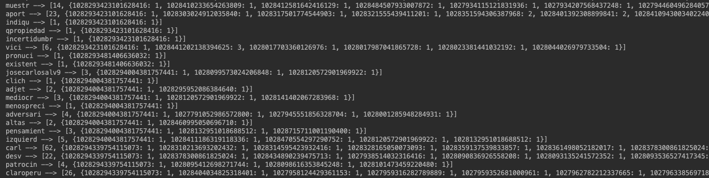
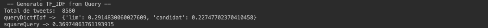
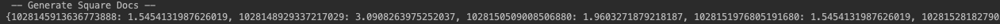
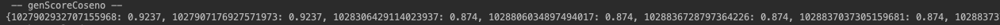
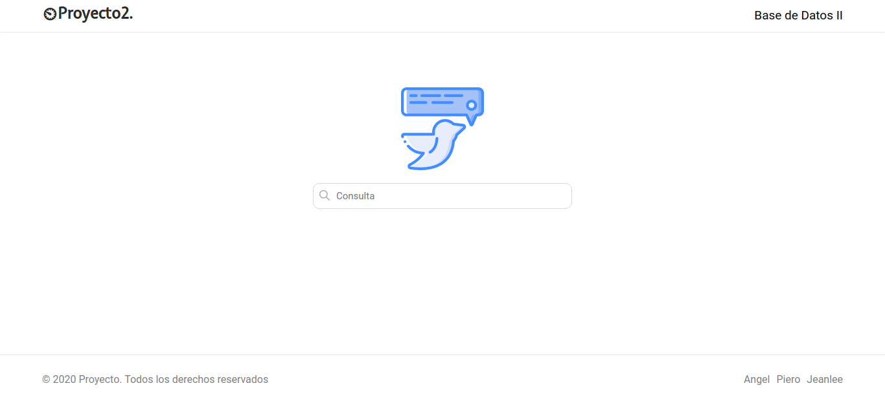
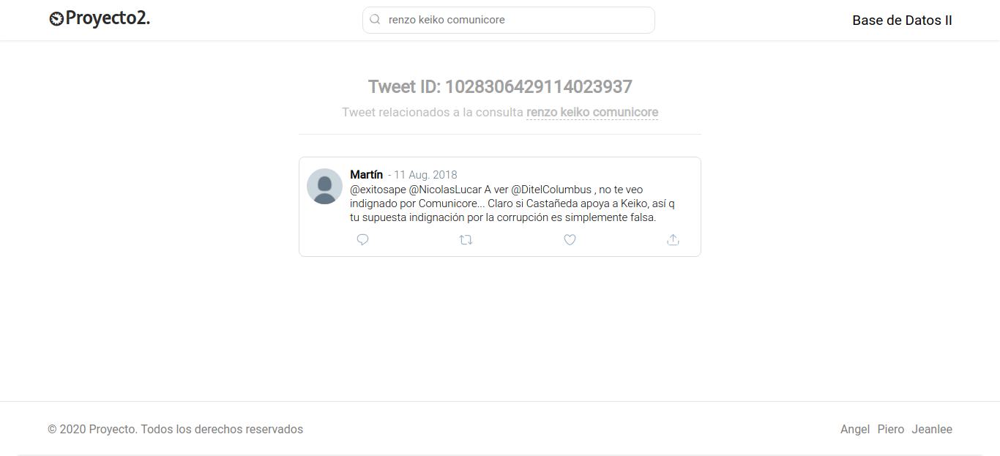

# Proyecto 2 Base de Datos
Recuperación de documentos de texto

## Resúmen
Este proyecto consiste en la aplicación de los algoritmos de búsqueda y recuperación de la información basada en el contenido. Este proyecto está enfocado a la construcción óptima del Índice Invertido para tareas de búsqueda y recuperación en documentos de texto.

## Backend
En el proyecto se ha implementado el ínidice invertido para la recuperación de texto usando el modelo de recuperación por ranking para consultas de texto libre, considerando las siguientes etapas generales.

1. Preprocesamiento
   * Tokenización
   * Filtrado de stopwords
   * Reducción de palabras mediante Stemming
   
2. Construcción del índice
   * Estructurar el índice para obtener los pesos TF-IDF
   * Manejo del índice en memoria secundaria para soportar grandes cantidades de datos.
      + Uso de Blocked Sort-Based Indexing
 
3. Consultas
   * La consulta está formada por una o más palabras en lenguaje natural.
   * El puntaje (score) obtenido está basado en la similitud de coseno y retorna una lista ordenada de documentos que se aproximan a la consulta.
   
## Frontend
Para probar el desempeño del índice invertido, se ha construido una aplicación frontend que permite interactuar con las principales operaciones del índice invertido, que son las siguientes.
* Carga e indexación de los documentos en tiempo real
* Búsqueda textual relacionada a los temas de interés
* Presentación de los resultados de forma amigable e intuitiva.

## Implementación
### Backend
#### Preprocesamiento
Primero se extraen los nombres de los archivos json que se encuentran en el directorio que se quiere evaluar, y se guarda en una lista.
```
listaArchivos = os.listdir(dirName)
```
Luego se procede a guardar los stopwords que se encuentran en un archivo de texto plano, y se guardan en una lista para hacer el filtrado del contenido de los archivos json más adelante.
```
stopwords = list()
stopFile = codecs.open("stoplist.txt", "r", "utf-8")
    for line in stopFile:
        line = line.strip()
        line = line.lower()
        words = line.split(" ")
        for word in words:
            if word not in stopwords:
                stopwords.append(word)
```
Finalmente, se realiza una iteración sobre cada uno de los archivos json. Para cada archivo, se itera sobre cada uno de sus elementos, que vendrían a ser los tweets, se hace la separación en palabras del atributo RT_text o text dependiendo si es retweet o no, para obtener el texto original. Luego se hace la eliminación de los caracteres especiales y la transformación de todas las letras a minúscula. Después, se hace el filtrado de los stopwords y las direcciones url y se guarda temporalmente en una lista que va a contener las palabras filtradas de ese tweet. Finalmente, se realiza el proceso de Stemming y se agregan las palabras resultantes a la lista de tokens totales, se eliminan las palabras duplicadas y se retorna la lista de tokens totales.
```
for archivo in listaArchivos:
    for tweet in tweets:
        if tweet['retweeted'] is True:
            texto = tweet['RT_text']
        else:
            texto = tweet['text']
        texto = texto.strip()
        texto = re.sub('[¿|?|$|.|,|:|;|!|º|«|»|(|)|@|¡|"|😆|“|/|#|%]', '', texto)
        texto = texto.lower()
        for token in tokens:
            if token in stopwords:
                continue
            if "http" in token:
                continue
            keywords.append(token)
        stemmer = SnowballStemmer('spanish')
        for token in keywords:
            tokensTotales.append(stemmer.stem(token))
    tokensTotales = list(dict.fromkeys(tokensTotales))
return tokensTotales
```

#### Construcción del índice invertido
La generación del índice invertido es realizado durante la carga inicial de la aplicación mediante la llamada a la función "def inicial()"  definido en el archivo indexDB.py.
```
def inicial():
    files = os.listdir('indice')
    if len(files) == 0:
        listResult = generateIndex()
        saveIndex(listResult)
    else:
        listResult = readIndex()
    indexDb = listResult[0]
    numTotalTweets = listResult[1]
    for term in indexDb:
        print(term, "-->", indexDb[term])
    return listResult
```
Desde la función inicial, realizan las siguiente actividades:
- Se verifica la existencia un indice en memoria secundaria:
  + Si no existe un indice en memoria secundaria, se invoca la función generateIndex() y luego la función saveIndex(listResult) se encarga de guardar a disco el índice.
  + Si existe un indice se invoca la función readIndex() el cual carga hacia memoria principal el indice existente.
La función inicial retorna una lista con los siguientes elementos:
- Indice invertido: el cual es una estructura diccionario que tiene como key un keyword o término y como value una lista con 2 elementos el primer elemento es Document Frequency (número de tweets en el cual aparece dicho término) y el segundo elemento es un diccionario que tiene como key los tweetId (documentID) y el term Frequency del término en dicho tweetId.
- Número total de tweets: el total de tweets en la colección.

Estructura del indice invertido:



#### Implementación de consultas
Desde la capa de frontend se hace una llamada a la función "queryIndex(indexDb, query_str, numTotalTweets)" la cual recibe como argumentos:
- el indice invertido
- el query como string
- el total de tweets de la colección

```
def queryIndex(indexDb, query_str, numTotalTweets):
    print("-- Searching Query in IndexDb --")
    query = stemQuery(query_str)
    querytfIdf_square_par = genQuerytfIdf(query, indexDb, numTotalTweets)
    if len(querytfIdf_square_par[0]) != 0:
        dicTweetsId_tf_idf = genDocsTfIdf(query, indexDb, numTotalTweets)
        dicTweetIdSquares = genSquareByDoc(dicTweetsId_tf_idf)
        dicScoreCoseno = genScoreCoseno(dicTweetsId_tf_idf, dicTweetIdSquares, querytfIdf_square_par)
        print(dicScoreCoseno)
        dicKScoreCoseno = kresultados(dicScoreCoseno, 50)
        print(dicKScoreCoseno)
        return dicKScoreCoseno
    return {}
```

La ejecución de la consulta realiza las siguientes actividades:

- El query pasa por un proceso de stemming, para reducir a sus raiz las palabras del query.
```
query = stemQuery(query_str)
```
- Generación del tf_idf y la norma del query


- Generación del tf_idf de los documentos (relacionados a los términos del query).


- Generación de la norma de cada de unos de los documentos (relacionados a los términos del query).


- Generación de los scores basado en la similitud de coseno.


- Generación de una lista ordenada de los k elementos que se aproximan a la consulta.
Se retora un diccionario con los k resultados más cercanos a la consulta.

#### Implementación

### Frontend
#### Recuperación de Tweets con Twython
Una vez obtenidos los resultados de la consulta, que son los k twwets con mayor puntaje en relación con la consulta, si el usuario lo desea puede ver el tweet original haciendo click en la opción 'Ver tweet +'. Para implementar esta función, se ha hecho uso de la API Twython, la cual nos permite realizar recuperación de datos de Twitter directamente desde Python. Para ello, primero se debe ingresar las credenciales de desarrollador en el constructor de Twython.
```
twitter = Twython(CONSUMER_KEY, CONSUMER_SECRET, OAUTH_TOKEN, OAUTH_TOKEN_SECRET)
```
Luego, se invoca al método que muestra el estado del tweet, que basicamente retorna un json con todos los campos del tweet. en esos campos, se realiza la comprobación si es que es retweet o no, para extraer siempre el texto original. Estos datos se almacenan en un diccionario junto con la fecha y el username y se retorna a la función searchTweet para mostrarlo en el navegador.
```
tweet = twitter.show_status(id=tweetId, tweet_mode='extended')
infoTweet = {}
infoTweet['text'] = tweet['full_text']
    if infoTweet['text'][0] + infoTweet['text'][1] == "RT":
        infoTweet['rt_status'] = True
        infoTweet['text'] = tweet['retweeted_status']['full_text']
    else:
        infoTweet['rt_status'] = False
    infoTweet['date'] = tweet['created_at']
    infoTweet['username'] = tweet['user']['name']
    infoTweet['user_scree_name'] = "@" + tweet['user']['screen_name']
    return infoTweet
```

#### Uso de Flask y Jinja

Para la visualización de los resultados y la interacción del usuario con el programa a través del navegador hemos utilizado el microframework `Flask`. Gracias a `Jinja` podemos presentar páginas dinámicas y con la ayuda de `Flask` usamos disparadores que activan funciones específicas relacionan con rutas URLs que podemos programar dentro de python.

Para usar este microframework debemos importar la clase `Flask` e instanciarla como se muestra a continuación:

    from flask import Flask
    app = Flask(__name__)

Para nuestra página principal estamos usando la ruta `'\'`, la cual usa flask por defecto al momento de arrancar el servicio. Lo que mostramos al usuario es nuestro `index.html` el cual tiene un campo de entrada para que el usuario realice su consulta.
`Flask` renderiza este archivo a través del método `render_template()`

    @app.route('/')
    def hello_world():
        return render_template("index.html")

Para mostrar los id de los tweets que se están buscando relacionados a una consulta usamos la ruta `\search`. El método relacionado a esta ruta se llama `searchFile` y se activa cuando el usuario envía su consulta a través del campo de entrada en la página de inicio. A continuación, se muestra la estructura del buscador donde se aprecia la llamada a la función descrita previamente.

    <form action="{{ url_for('searchFile') }}">
        <input type="text" name="query" placeholder="Consulta" id="buscador">
        <input type="submit" value="Buscar" id="btn">
    </form>

La consulta brindada por el usuario en el formulario (donde se encuntra eñ campo de entrada) se obtiene en Python con la clase `request`. Luego, procesamos la consuta y obtenemos los tweets id relacionados a esta mediante nuestro método `queryIndex()`. Mostramos los resultados en la página `resultado.html` la cual, con el el uso de `Jinja`, espera los parámetros de `consulta` (brindada por el usuario) y `tweets` (la lista de los tweets id ordenados por su score) A continuación, se muestra la implementación.

    @app.route("/search")
    def searchFile():
        query = request.args.get("query")
        tweets = queryIndex(indice, query, numTotalTweets)
        return render_template("resultado.html", consulta=query, tweets=tweets)

Si queremos visualizar el contenido de dicho tweet usamos la función `searchTweet(consulta, tweet_id)` la cual está relacionada a la ruta `/search/<string:consulta>/<int:tweet_id>`. Dentro de la página `resultado.html` le damos al usuraio la opción de *Ver Tweet +*, dicho elemento manda al usuario a la ruta previamente descrita.
A coninuación, se muestra cuando se haría la llamada a la ruta.

    <a class="go" href="/search/{{consulta}}/{{tweet}}">
        Ver tweet +
    </a>

La función `searchTweet` usa nustro método `getTwet()` que interactua con la API de Twitter para obtener la información relacionada al Tweet id. Toda la información se mostrará mediante por el archivo `tweets.html` el cual, con el uso de  `Jinja`, espera los parámetros `consulta`, `tweet_id` y  `tweet`. Este último es un diccionario que contiene la información a mostrar del Tweet. A continuación, se muestra la implementación en Python.

    @app.route("/search/<string:consulta>/<int:tweet_id>")
        def searchTweet(consulta, tweet_id):
        consult_formated = consulta.lower()
        tweet = getTweet(str(tweet_id))
        return render_template("tweets.html", consulta=consulta, tweet_id = tweet_id, tweet = tweet)


## Testing
Para realizar las pruebas del índice, se han cargado 25 archivos en formato json con un total 32 831 tweets y un tamaño de 15 MB que van a ser analizados durante la consulta. Para poder realizar la consulta, se debe ejecutar el servidor de flask que se encuentra en el archivo front.py el cual muestra la siguiente ventana de búsqueda en el navegador.



En esta ventana se procede a realizar una consulta que puede contener una o más palabras de lenguaje natural y que pueden estar relacionadas o con el tema de los tweets que son sobre los candidatos a la alcaldía de Lima. Los resultados se muestran de la siguiente manera.


En esta parte se muestran los 'k' tweets con mayor puntaje en relación a la consulta. Y si el usuario lo desea, puede hacer click en el botón 'Ver tweet +' en la columna 'Detalles' para visualizar el contenido del tweet correspondiente a ese ID de tweet. Por ejemplo, en la consulta hecha anteriormente 'renzo keiko comunicore', al mostrar los detalles del tweet con mayor puntaje de 0.9318 se muestra el siguiente contenido.


