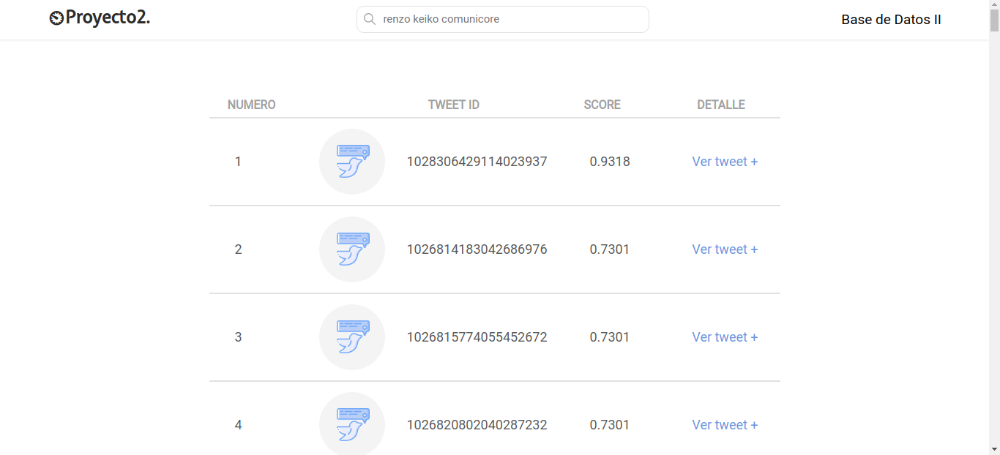

# Proyecto 2 Base de Datos
Recuperación de documentos de texto

## Resúmen
Este proyecto consiste en la aplicación de los algoritmos de búsqueda y recuperación de la información basada en el contenido. Este proyecto está enfocado a la construcción óptima del Índice Invertido para tareas de búsqueda y recuperación en documentos de texto.

## Backend
En el proyecto se ha implementado el ínidice invertido para la recuperación de texto usando el modelo de recuperación por ranking para consultas de texto libre, considerando las siguientes etapas generales.

1. Preprocesamiento
   * Tokenización
   * Filtrado de stopwords
   * Reducción de palabras mediante Stemming
   
2. Construcción del índice
   * Estructurar el índice para obtener los pesos TF-IDF
   * Manejo del índice en memoria secundaria para soportar grandes cantidades de datos.
      + Uso de Blocked Sort-Based Indexing
 
3. Consultas
   * La consulta está formada por una o más palabras en lenguaje natural.
   * El puntaje (score) obtenido está basado en la similitud de coseno y retorna una lista ordenada de documentos que se aproximan a la consulta.
   
## Frontend
Para probar el desempeño del índice invertido, se ha construido una aplicación frontend que permite interactuar con las principales operaciones del índice invertido, que son las siguientes.
* Carga e indexación de los documentos en tiempo real
* Búsqueda textual relacionada a los temas de interés
* Presentación de los resultados de forma amigable e intuitiva.

## Implementación
### Backend
#### Preprocesamiento
Primero se extraen los nombres de los archivos json que se encuentran en el directorio que se quiere evaluar, y se guarda en una lista.
```
listaArchivos = os.listdir(dirName)
```

### Frontend

## Testing
Para realizar las pruebas del índice, se han cargado 25 archivos en formato json con un total 32 831 tweets y un tamaño de 15 MB que van a ser analizados durante la consulta. Para poder realizar la consulta, se debe ejecutar el servidor de flask que se encuentra en el archivo front.py el cual muestra la siguiente ventana de búsqueda en el navegador.


En esta ventana se procede a realizar una consulta que puede contener una o más palabras de lenguaje natural y que pueden estar relacionadas o con el tema de los tweets que son sobre los candidatos a la alcaldía de Lima. Los resultados se muestran de la siguiente manera.



En esta parte se muestran los 'k' tweets con mayor puntaje en relación a la consulta. Y si el usuario lo desea, puede hacer click en el botón 'Ver tweet +' en la columna 'Detalles' para visualizar el contenido del tweet correspondiente a ese ID de tweet. Por ejemplo, en la consulta hecha anteriormente 'renzo keiko comunicore', al mostrar los detalles del tweet con mayor puntaje de 0.9318 se muestra el siguiente contenido.


